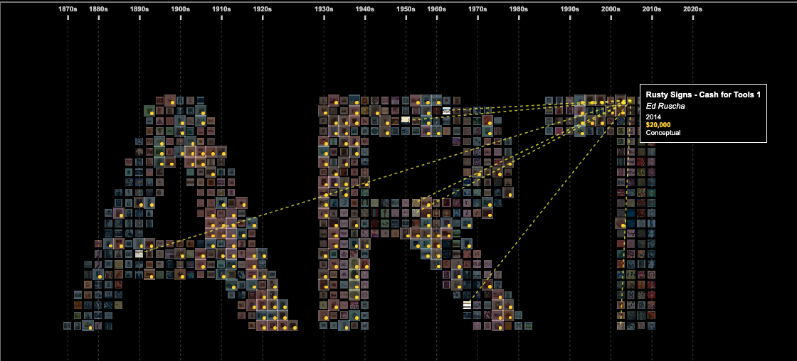

# Art Dataset Visualization


This folder contains the code and data for a D3.js-based data visualization project focused on analyzing an art dataset. The project was developed as part of a data visualization course assignment.

## Design Details

### Layout

- **Artwork images are arranged to form the word "ART"** using a custom canvas-based layout.
- **Chronological organization:** Artworks are placed from left (earliest) to right (latest) within the word structure.

### Visual Channels

- **Color overlay:** Each artwork image is tinted with a color representing its art movement (different colors for different movements).
- **Gold dot:** Especially high-priced artworks are marked with a gold dot overlay.

### Interactions



- **Hover:** Displays a detailed tooltip with the artwork's title, artist, year, price, and movement.
- **Hover over an artist:** Highlights all artworks by the same artist.
- **Click:** Highlights all artworks by the same artist, connects them with yellow lines, and keeps the highlight active.
- **Click outside:** Removes the artist highlight and connection lines.
- **Double-click:** Opens a full-screen browsing mode to explore all artworks by that artist.

### Custom Visualization Category

This visualization is considered **novel** because it:

- Uses text-based layout generation (forming "ART") with canvas drawing.
- Arranges data chronologically within a typographic structure.
- Highlights artist relationships with interactive connection lines.
- Was built from scratch, not by modifying an existing chart type, to reveal temporal, stylistic, and artist connections simultaneously.

## Contents

- `index.html` — Main HTML file to view the visualization in a browser.
- `main.js` — JavaScript file containing the D3.js code for the visualization.
- `styles.css` — CSS file for styling the visualization and page.
- `artDataset.csv` — The primary dataset used for the visualization.
- `Cleaned_Art_Dataset.csv` — A cleaned version of the art dataset.
- `hovering.png`, `result.png` — Example output images or screenshots.
- `artDataset/` — Folder containing images referenced in the dataset.

## Features

- Interactive D3.js visualizations for exploring the art dataset.
- Data-driven graphics and interactivity.
- Cleaned and raw data for reproducibility.

## How to Run

1. **Clone the repository:**
   ```sh
   git clone <your-repo-ssh-url>
   ```
2. **Navigate to the project folder:**
   ```sh
   cd "homework 4 and 5/homework 5"
   ```
3. **Open `index.html` in your web browser.**
   - You can simply double-click the file, or use a local web server for best results (recommended for loading local images and data):
   ```sh
   python3 -m http.server
   # Then visit http://localhost:8000 in your browser
   ```

## Requirements

- Modern web browser (Chrome, Firefox, Edge, etc.)
- [D3.js](https://d3js.org/) (loaded via CDN in `index.html`)

## Author

- Shivam Sharma

---

Feel free to explore, modify, and extend the visualization for your own analysis!
